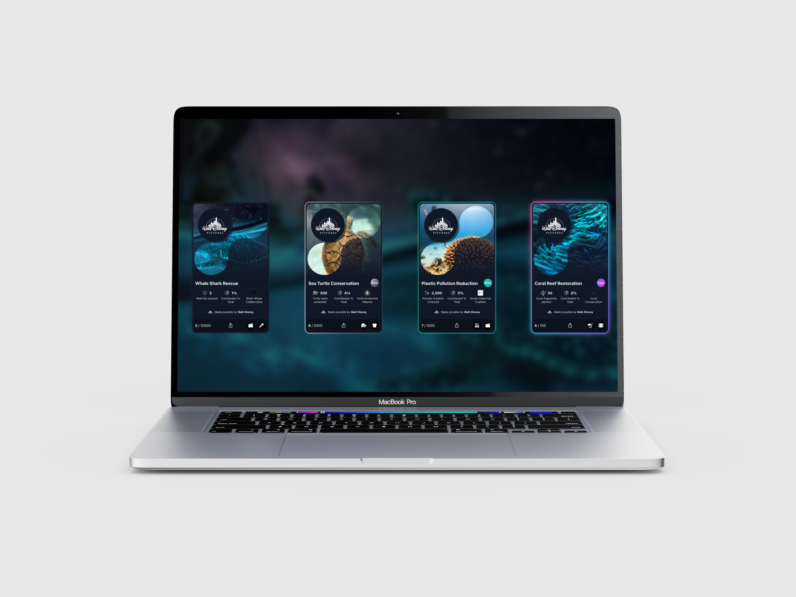
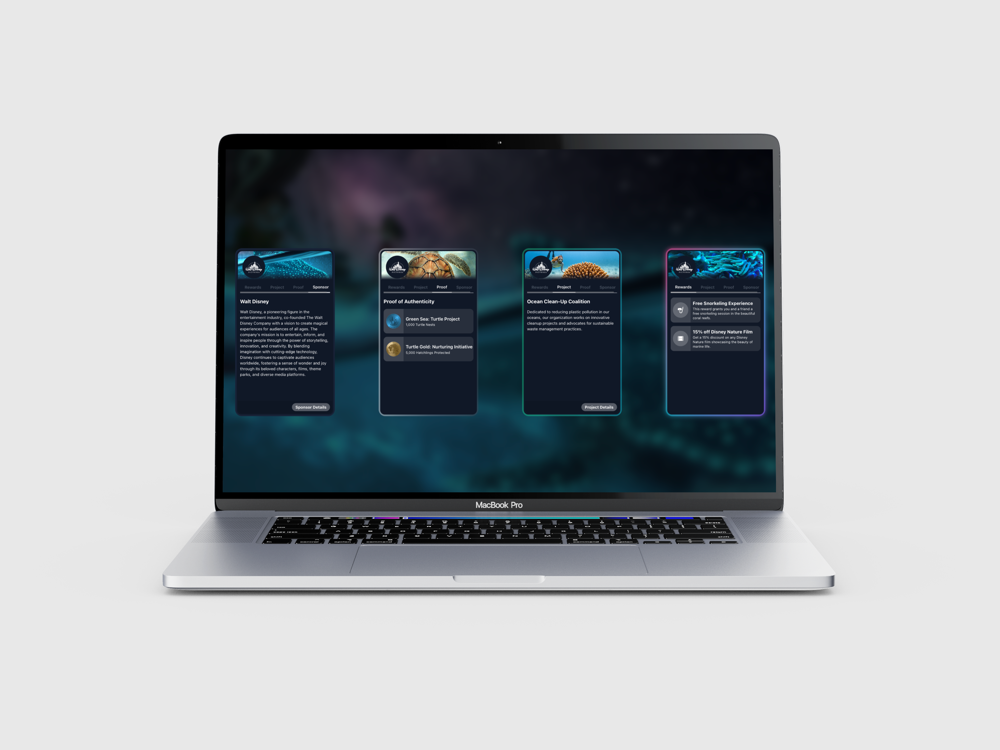
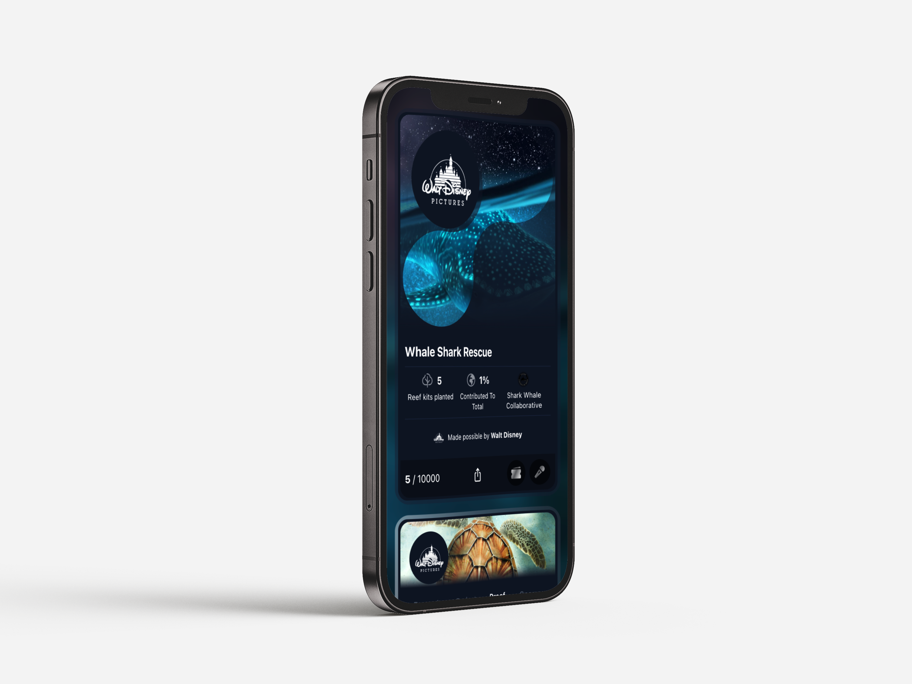

## Everclime - Impact Card




**Description:**

This project demonstrates a concept for a gamified impact card, inspired by Everclime's platform. The goal is to engage users through a visually appealing and interactive experience, showcasing their positive impact on the environment.

**Key Features:**

- **Rarity Badges:** Engage users with a collectible element by assigning rarity badges (common, rare, mint, epic) to impact cards.
- **Collections:** Group multiple impact cards under a single theme or brand
- **Interactive Animations:** Enhance user experience with animations like metallic shimmers and flip effects.
- **Mobile-First Design:** Prioritize a seamless experience on mobile devices.
- **Flexible and Modular Codebase:** Allow for easy customization and integration into different platforms.

**Technology Stack:**

* React, JavaScript, TypeScript, TailwindCSS, CSS, HTML

**Installation:**

1. **Clone the repository:**
   ```bash
   git clone https://github.com/SilasNiewierra/impact-card.git
   ```
2. **Install dependencies:**
   ```bash
   npm install
   ```
3. **Run the development server:**
   ```bash
   npm start
   ```

### **Demo: The Moana Collection** :whale2:

The Moana Collection is a curated set of impact cards inspired by the Disney movie "Moana." This collection aims to create a thematic and engaging experience for users while highlighting environmental themes relevant to the film.

Live demo: https://impact-card.vercel.app/



**Idea Behind the Collection:**

* **Leverage the Film's Popularity:** By tying the impact cards to a well-known and beloved movie like "Moana," we can tap into a wider audience and generate more interest.
* **Promote Environmental Awareness:** The collection can be used to educate users about the importance of ocean conservation, sustainable practices, and cultural preservation, all of which are themes explored in the film.
* **Create a Coherent Narrative:** Each impact card within the collection can be designed to represent a specific aspect of Moana's journey or the Polynesian culture, providing a cohesive and immersive experience.

**Example Impact Cards:**

* **"Wayfinder's Compass":** This card could represent the importance of navigation and exploration, while also highlighting the need for sustainable travel and resource management.
* **"Heart of Te Fiti":** This card could focus on the concept of restoring balance and harmony with nature, emphasizing the importance of protecting ecosystems and biodiversity.
* **"Maui's Transformation":** This card could explore the idea of personal growth and responsibility, encouraging users to make positive changes in their own lives to contribute to a healthier planet.

By creating a collection based on "Moana," we can offer users a unique and meaningful way to connect with the film's themes and take action to make a positive impact on the environment.




**Future Enhancements:**

* **Social Sharing:** Implement features for users to share their impact cards on social media.
* **Leaderboard:** Create a leaderboard system to encourage competition and recognition among users.


